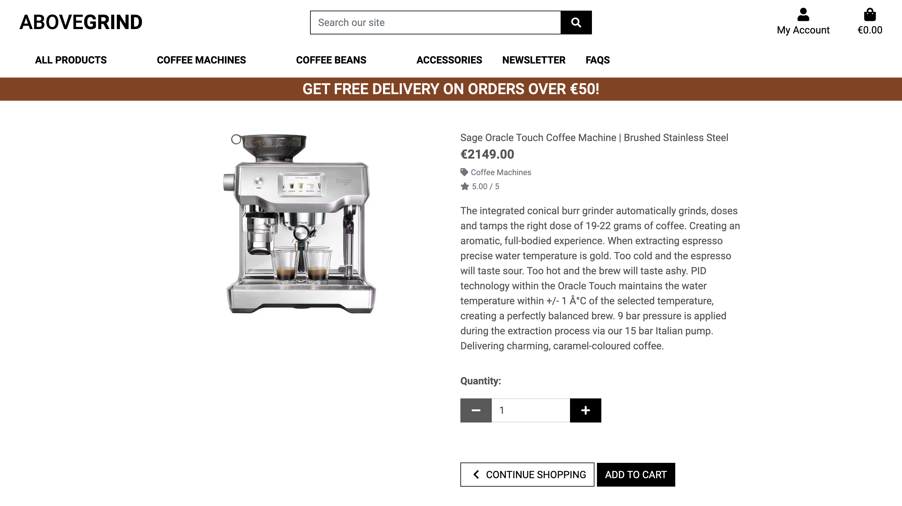
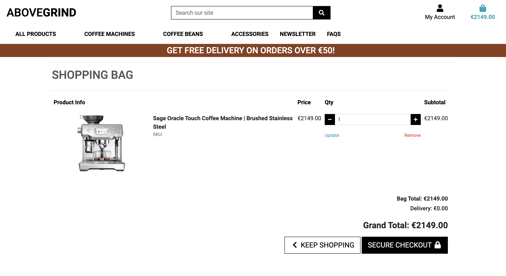
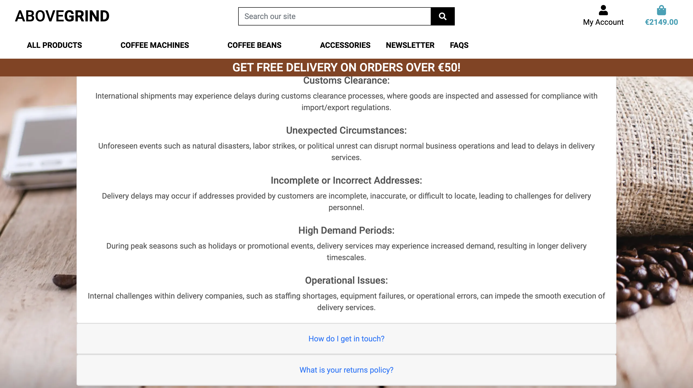
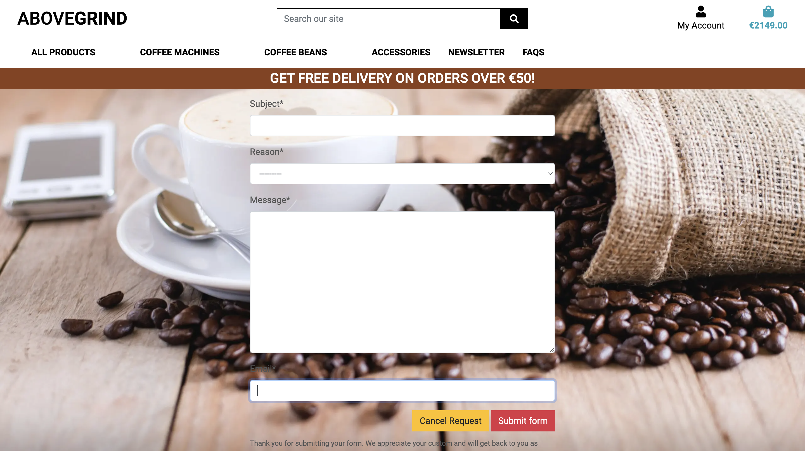

# [ABOVE GRIND](https://above-grind-d535f4f31606.herokuapp.com)

Welcome to Above Grind. A website I designed for all coffee lovers, to purchase coffee machines, coffee beans (of their choice) and accessories. With choices to sign up to a newsletter/subscribe to the site. Read about our faqs and returns. And have a clear way to contact us via a contact us form. 

Consider adding a mockup image using the "Am I Responsive" website.
Here's your deployed site as an example:
https://ui.dev/amiresponsive?url=https://above-grind-d535f4f31606.herokuapp.com


## UX

During my approach to the design process for this site. I wanted it to be user friendly and easy to use for users of all ages. The simplistic straight forward way around the website shows the user exactly what they are there to get and the titles in the navbar - which include only one dropdown for the various different types of coffee. Make it easy for the user to maneuver around the site at ease. 
I aimed for the layout of the pages to be black and white for readability and no issue to see what the product was you wanted to view or to buy.  And when clicking into a product you are brought to a page which holds an indept description of the product you wish to get, and gives you an option to add it to your back or proceed to continue shopping.
Having majority of the text in black against the white background assures good readablity for users.
While having a newsletter in the navbar for users to click, or a subcribe section down the bottom in the footer so users have two options to sign up and recieve updates on new products and discounts etc.
An easy straight to the point contact us form, located in the footer and again in the FAQs page. Which is an informative part of the website that includes deliveries, delivery delays, and a section to click for our returns policy.

### Colour Scheme

For my colour scheme , I chose black and white to be the main colours with the brown strip under the navbar that stands out for users to see the free delivery when you spent over a certain amount.
With the odd little bit of colour for the toast messages and edit/update/delete buttons.

- `#000000` used for primary text.
- `##89401C` used for banner under navbar.
- `##555555` used for secondary text.
- `##FFFFFF` used for backgrounds and some text in buttons.

I used [coolors.co](https://coolors.co/000000-89401c-555555-ffffff) to generate my colour palette.


### Typography

The font I chose to go with continues throughout the entire site.

- ['Roboto'](https://fonts.google.com/?query=Roboto) was used for all text. While adding - text-transform: uppercase; to headings and titles.


## User Stories

### New Site Users

- As a new site user, I would like to see what the site sells, so that I can know I am in the right place to purchase what I'm looking for.
- As a new site user, I would like to be able to manoeuvre around the site at ease, so that I don't have to ask for help (depending on age).
- As a new site user, I would like to be able to click a sort button so that I can find my product my price/rating.
- As a new site user, I would like to have the option to add the number of products to my bag, so that I can click one button instead of adding it more than once.
- As a new site user, I would like to have the option to save my info so that I don't have to retype it if I should return.
- As a new site user, I would like to have the option to sign up to a newsletter or subscribe so I can recieve updates on new products or discounts.
- As a new site user, I would like to recieve and confirmation email containing my accounts information and summary of my order.
- As a new site user, I would like to have the option to sign up and create a profile to access my orders.

### Returning Site Users

- As a returning site user, I would like the site to remain similar, so that I can move around the site like I had previously.
- As a returning site user, I would like to have my information saved on my account, so that I can go through checkout quickly.
- As a returning site user, I would like to be able to access my past orders, so that I can see when and what I bought before.

### Site Admin

- As a site administrator, I should be able to be able to update/edit products so that I can keep them up to date for users.
- As a site administrator, I should be able to delete products, so that I can remove them from the site.
- As a site administrator, I should be able to make changes to products on the site page so that I can update them at ease without having to access admin panel.

## Wireframes

🛑🛑🛑🛑🛑 START OF NOTES (to be deleted) 🛑🛑🛑🛑🛑

In this section, display your wireframe screenshots using a Markdown `table`.
Instructions on how to do Markdown `tables` start on line #213 on this site: https://pandao.github.io/editor.md/en.html

Alternatively, dropdowns are a way to condense several wireframes into a collapsible menu to save space.
Dropdowns in Markdown are considered some of the only acceptable HTML components that are allowed for assessment purposes.

**IMPORTANT**! **IMPORTANT**! **IMPORTANT**!
The example below uses the `details` and `summary` code elements.
However, for these scripts to work, I've had to add spaces within the `< >` elements.

You MUST remove these spaces for it to work properly on your own README/TESTING files.
Remove the spaces within the `< >` brackets for the `details` and `summary` code elements,
for the Mobile, Tablet, and Desktop wireframes.

🛑🛑🛑🛑🛑 END OF NOTES (to be deleted) 🛑🛑🛑🛑🛑

To follow best practice, wireframes were developed for mobile, tablet, and desktop sizes.
I've used [Balsamiq](https://balsamiq.com/wireframes) to design my site wireframes.

### Mobile Wireframes

< details >
< summary > Click here to see the Mobile Wireframes < / summary >

Home
  - 

Products
  - 

Product Details
  - 

Checkout
  - 
  
  Newsletter
  - 
  
  FAQs
  - 
  
  Contact Us
  - 

< / details >

### Tablet Wireframes

< details >
< summary > Click here to see the Tablet Wireframes < / summary >

Home
  - 

Products
  - 

Product Details
  - 

Checkout
  - 
  
  Newsletter
  - 
  
  FAQs
  - 
  
  Contact Us
  - 


< / details >

### Desktop Wireframes

< details >
< summary > Click here to see the Desktop Wireframes < / summary >

Home
  - 

Products
  - 

Product Details
  - 

Checkout
  - 
  
  Newsletter
  - 
  
  FAQs
  - 
  
  Contact Us
  - 


< / details >

## Features

🛑🛑🛑🛑🛑 START OF NOTES (to be deleted) 🛑🛑🛑🛑🛑

In this section, you should go over the different parts of your project,
and describe each in a sentence or so.

You will need to explain what value each of the features provides for the user,
focusing on who this website is for, what it is that they want to achieve,
and how your project is the best way to help them achieve these things.

For some/all of your features, you may choose to reference the specific project files that implement them.

IMPORTANT: Remember to always include a screenshot of each individual feature!

🛑🛑🛑🛑🛑 END OF NOTES (to be deleted) 🛑🛑🛑🛑🛑

### Existing Features

- **Navbar navigation**

    - I based the navigation similar Boutique Ado to have a concise and clear option for an e-commerce store.


- **Products Page**

    - The products page is responsive to allow equal spacing between products regardless of screen width.
	Each category has it's own page, when the All Products link holds all of the products the site has to offer.


- **Product Detail Page**

    - The product details page holds all the information about the product that a customer could need. Including the description, price and rating.
	While giving them an option to return back to shopping if the product doesn't suit them .


- **Bag**

    - The bag page shows the user what is in their bag that they intend to purchase.  It shows them the grand total of each product and if they have a remaining delivery charge. 
	Also giving the user the option to update the quantity of each product via plus or subtract buttons supplied for them.
	

- **Checkout / Payment**

    - The Checkout page brings the user to enter in all of their details for the delivery of their items. Giving them the option to save their details to their account for later purchases.
	(Although user has to be logged in to save their details by logging in or creating an account) - I have minimised the page to 75% in the image to show you the entire screen details in one photo.


- **FAQs**

    - Our FAQs page has all of the information a customer could need regarding any issue they may face with our site, or delivery system. Including other dropdowns entailing the information they may need for how to get in touch with us and our returns policy.


- **Contact Us**

    - The contact us page is for a user to send us an email of any enquiry they may have. They are given a form with a field for each of the following - a subject, a reason, a message and their own email address. Each of these are required. 
	They are presented with a submit button or the option to cancel request.


### Future Features


- Profile
    - I would have liked to add more to the users account in regarding a profile. By giving them an option to add an image to their account.
- Wishlist
    - I would have liked to add a wishlist feature to each users profile when they were logged in, so they could come back to the products they liked before.
- Discount for new users
    - To add a 10% discount pop up on the homepage for new users when they use the site, to make them feel valued as a new customer.
- Birthday discounts
	- To send a Happy Birthday discount to the users who have subscribed or signed up to our newsletter when it is their birthday.
- Product Reviews
	- To give customers who have bought a product to leave their own reviews on how they felt the product was.

## Tools & Technologies Used


- [HTML](https://en.wikipedia.org/wiki/HTML) used for the main site content.
- [CSS](https://en.wikipedia.org/wiki/CSS) used for the main site design and layout.
- [JavaScript](https://www.javascript.com) used for user interaction on the site.
- [Python](https://www.python.org) used as the back-end programming language.
- [Git](https://git-scm.com) used for version control. (`git add`, `git commit`, `git push`)
- [GitHub](https://github.com) used for secure online code storage.
- [GitHub Pages](https://pages.github.com) used for hosting the deployed front-end site.
- [Gitpod](https://gitpod.io) used as a cloud-based IDE for development.
- [Bootstrap](https://getbootstrap.com) used as the front-end CSS framework for modern responsiveness and pre-built components.
- [Flask](https://flask.palletsprojects.com) used as the Python framework for the site.
- [Django](https://www.djangoproject.com) used as the Python framework for the site.
- [PostgreSQL](https://www.postgresql.org) used as the relational database management.
- [ElephantSQL](https://www.elephantsql.com) used as the Postgres database.
- [Heroku](https://www.heroku.com) used for hosting the deployed back-end site.
- [Cloudinary](https://cloudinary.com) used for online static file storage.
- [Stripe](https://stripe.com) used for online secure payments of ecommerce products/services.
- [AWS S3](https://aws.amazon.com/s3) used for online static file storage.

## Database Design

Entity Relationship Diagrams (ERD) help to visualize database architecture before creating models.
Understanding the relationships between different tables can save time later in the project.

```
from django.db import models

class Contact(models.Model):
    """ Contact form model """
    CONTACT_CHOICES = [
        ('general', 'General Enquiry'),
        ('order', 'Order Enquiry '),
        ('return', 'Return Request'),
        ('complaint', 'Complaint'),
    ]
    subject = models.CharField(max_length=150)
    reason = models.CharField(max_length=45, choices=CONTACT_CHOICES)
    message = models.TextField(max_length=800)
    email = models.EmailField()

    def __str__(self):
        return self.email
```
```
from django.db import models


class Newsletter(models.Model):
    email = models.EmailField(max_length=256, null=True, blank=False)
    name = models.CharField(max_length=100, null=True, blank=False)
    

    def __str__(self):
        return self.email

```
```
from django.db import models


class FAQ(models.Model):
    """ FAQs model. """
    question = models.CharField(max_length=250, null=False, blank=False)
    answer = models.TextField(null=False, blank=False)

    class Meta:
        verbose_name_plural = "FAQs"
        ordering = ["question", ]

    def __str__(self):
        return self.question
```


## Agile Development Process

### GitHub Projects

[GitHub Projects](https://github.com/shellym96/above_grind/projects) served as an Agile tool for this project.
It isn't a specialized tool, but with the right tags and project creation/issue assignments, it can be made to work.

Through it, user stories, issues, and milestone tasks were planned, then tracked on a weekly basis using the basic Kanban board.


### MoSCoW Prioritization

I've decomposed my Epics into stories prior to prioritizing and implementing them.
Using this approach, I was able to apply the MoSCow prioritization and labels to my user stories within the Issues tab.

- **Must Have**: guaranteed to be delivered (*max 60% of stories*)
- **Should Have**: adds significant value, but not vital (*the rest ~20% of stories*)
- **Could Have**: has small impact if left out (*20% of stories*)
- **Won't Have**: not a priority for this iteration

## Ecommerce Business Model

This site sells goods to individual customers, and therefore follows a `Business to Customer` model.
It is of the simplest **B2C** forms, as it focuses on individual transactions, and doesn't need anything
such as monthly/annual subscriptions.

It is still in its early development stages, although it already has a newsletter, and links for social media marketing.

Social media can potentially build a community of users around the business, and boost site visitor numbers,
especially when using larger platforms such a Facebook.

A newsletter list can be used by the business to send regular messages to site users.
For example, what items are on special offer, new items in stock,
updates to business hours, notifications of events, and much more!

## Search Engine Optimization (SEO) & Social Media Marketing

### Keywords

I've identified some appropriate keywords to align with my site, that should help users
when searching online to find my page easily from a search engine.
This included a series of the following keyword types

- Short-tail (head terms) keywords
- Long-tail keywords

I also played around with [Word Tracker](https://www.wordtracker.com) a bit
to check the frequency of some of my site's primary keywords (only until the free trial expired).

### Sitemap

I've used [XML-Sitemaps](https://www.xml-sitemaps.com) to generate a sitemap.xml file.
This was generated using my deployed site URL: https://above-grind-d535f4f31606.herokuapp.com

After it finished crawling the entire site, it created a
[sitemap.xml](sitemap.xml) which I've downloaded and included in the repository.

### Robots

I've created the [robots.txt](robots.txt) file at the root-level.
Inside, I've included the default settings:

```
User-agent: *
Disallow:
Sitemap: https://above-grind-d535f4f31606.herokuapp.com/sitemap.xml
```

Further links for future implementation:
- [Google search console](https://search.google.com/search-console)
- [Creating and submitting a sitemap](https://developers.google.com/search/docs/advanced/sitemaps/build-sitemap)
- [Managing your sitemaps and using sitemaps reports](https://support.google.com/webmasters/answer/7451001)
- [Testing the robots.txt file](https://support.google.com/webmasters/answer/6062598)

### Social Media Marketing

Creating a strong social base (with participation) and linking that to the business site can help drive sales.
Using more popular providers with a wider user base, such as Facebook, typically maximizes site views.


### Newsletter Marketing

I have incorporate a newsletter sign-up form on my application, to allow users to supply their email address if they are interested in learning more. 
I have done this by creating a custom model for the newsletter.


## Testing

For all testing, please refer to the [TESTING.md](TESTING.md) file.

## Deployment

The live deployed application can be found deployed on [Heroku](https://above-grind-d535f4f31606.herokuapp.com).

### ElephantSQL Database

This project uses [ElephantSQL](https://www.elephantsql.com) for the PostgreSQL Database.

To obtain your own Postgres Database, sign-up with your GitHub account, then follow these steps:

- Click **Create New Instance** to start a new database.
- Provide a name (this is commonly the name of the project: above_grind).
- Select the **Tiny Turtle (Free)** plan.
- You can leave the **Tags** blank.
- Select the **Region** and **Data Center** closest to you.
- Once created, click on the new database name, where you can view the database URL and Password.

### Amazon AWS

This project uses [AWS](https://aws.amazon.com) to store media and static files online, due to the fact that Heroku doesn't persist this type of data.

Once you've created an AWS account and logged-in, follow these series of steps to get your project connected.
Make sure you're on the **AWS Management Console** page.

#### S3 Bucket

- Search for **S3**.
- Create a new bucket, give it a name (matching your Heroku app name), and choose the region closest to you.
- Uncheck **Block all public access**, and acknowledge that the bucket will be public (required for it to work on Heroku).
- From **Object Ownership**, make sure to have **ACLs enabled**, and **Bucket owner preferred** selected.
- From the **Properties** tab, turn on static website hosting, and type `index.html` and `error.html` in their respective fields, then click **Save**.
- From the **Permissions** tab, paste in the following CORS configuration:

	```shell
	[
		{
			"AllowedHeaders": [
				"Authorization"
			],
			"AllowedMethods": [
				"GET"
			],
			"AllowedOrigins": [
				"*"
			],
			"ExposeHeaders": []
		}
	]
	```

- Copy your **ARN** string.
- From the **Bucket Policy** tab, select the **Policy Generator** link, and use the following steps:
	- Policy Type: **S3 Bucket Policy**
	- Effect: **Allow**
	- Principal: `*`
	- Actions: **GetObject**
	- Amazon Resource Name (ARN): **paste-your-ARN-here**
	- Click **Add Statement**
	- Click **Generate Policy**
	- Copy the entire Policy, and paste it into the **Bucket Policy Editor**

		```shell
		{
			"Id": "Policy1234567890",
			"Version": "2012-10-17",
			"Statement": [
				{
					"Sid": "Stmt1234567890",
					"Action": [
						"s3:GetObject"
					],
					"Effect": "Allow",
					"Resource": "arn:aws:s3:::your-bucket-name/*"
					"Principal": "*",
				}
			]
		}
		```

	- Before you click "Save", add `/*` to the end of the Resource key in the Bucket Policy Editor (like above).
	- Click **Save**.
- From the **Access Control List (ACL)** section, click "Edit" and enable **List** for **Everyone (public access)**, and accept the warning box.
	- If the edit button is disabled, you need to change the **Object Ownership** section above to **ACLs enabled** (mentioned above).

#### IAM

Back on the AWS Services Menu, search for and open **IAM** (Identity and Access Management).
Once on the IAM page, follow these steps:

- From **User Groups**, click **Create New Group**.
	- Suggested Name: `group-above_grind` (group + the project name)
- Tags are optional, but you must click it to get to the **review policy** page.
- From **User Groups**, select your newly created group, and go to the **Permissions** tab.
- Open the **Add Permissions** dropdown, and click **Attach Policies**.
- Select the policy, then click **Add Permissions** at the bottom when finished.
- From the **JSON** tab, select the **Import Managed Policy** link.
	- Search for **S3**, select the `AmazonS3FullAccess` policy, and then **Import**.
	- You'll need your ARN from the S3 Bucket copied again, which is pasted into "Resources" key on the Policy.

		```shell
		{
			"Version": "2012-10-17",
			"Statement": [
				{
					"Effect": "Allow",
					"Action": "s3:*",
					"Resource": [
						"arn:aws:s3:::your-bucket-name",
						"arn:aws:s3:::your-bucket-name/*"
					]
				}
			]
		}
		```
	
	- Click **Review Policy**.
	- Suggested Name: `policy-above_grind` (policy + the project name)
	- Provide a description:
		- "Access to S3 Bucket for above_grind static files."
	- Click **Create Policy**.
- From **User Groups**, click your "group-above_grind".
- Click **Attach Policy**.
- Search for the policy you've just created ("policy-above_grind") and select it, then **Attach Policy**.
- From **User Groups**, click **Add User**.
	- Suggested Name: `user-above_grind` (user + the project name)
- For "Select AWS Access Type", select **Programmatic Access**.
- Select the group to add your new user to: `group-above_grind`
- Tags are optional, but you must click it to get to the **review user** page.
- Click **Create User** once done.
- You should see a button to **Download .csv**, so click it to save a copy on your system.
	- **IMPORTANT**: once you pass this page, you cannot come back to download it again, so do it immediately!
	- This contains the user's **Access key ID** and **Secret access key**.
	- `AWS_ACCESS_KEY_ID` = **Access key ID**
	- `AWS_SECRET_ACCESS_KEY` = **Secret access key**

#### Final AWS Setup

- If Heroku Config Vars has `DISABLE_COLLECTSTATIC` still, this can be removed now, so that AWS will handle the static files.
- Back within **S3**, create a new folder called: `media`.
- Select any existing media images for your project to prepare them for being uploaded into the new folder.
- Under **Manage Public Permissions**, select **Grant public read access to this object(s)**.
- No further settings are required, so click **Upload**.

### Stripe API

This project uses [Stripe](https://stripe.com) to handle the ecommerce payments.

Once you've created a Stripe account and logged-in, follow these series of steps to get your project connected.

- From your Stripe dashboard, click to expand the "Get your test API keys".
- You'll have two keys here:
	- `STRIPE_PUBLIC_KEY` = Publishable Key (starts with **pk**)
	- `STRIPE_SECRET_KEY` = Secret Key (starts with **sk**)

As a backup, in case users prematurely close the purchase-order page during payment, we can include Stripe Webhooks.

- From your Stripe dashboard, click **Developers**, and select **Webhooks**.
- From there, click **Add Endpoint**.
	- `https://above-grind-d535f4f31606.herokuapp.com/checkout/wh/`
- Click **receive all events**.
- Click **Add Endpoint** to complete the process.
- You'll have a new key here:
	- `STRIPE_WH_SECRET` = Signing Secret (Wehbook) Key (starts with **wh**)

### Gmail API

This project uses [Gmail](https://mail.google.com) to handle sending emails to users for account verification and purchase order confirmations.

Once you've created a Gmail (Google) account and logged-in, follow these series of steps to get your project connected.

- Click on the **Account Settings** (cog icon) in the top-right corner of Gmail.
- Click on the **Accounts and Import** tab.
- Within the section called "Change account settings", click on the link for **Other Google Account settings**.
- From this new page, select **Security** on the left.
- Select **2-Step Verification** to turn it on. (verify your password and account)
- Once verified, select **Turn On** for 2FA.
- Navigate back to the **Security** page, and you'll see a new option called **App passwords**.
- This might prompt you once again to confirm your password and account.
- Select **Mail** for the app type.
- Select **Other (Custom name)** for the device type.
	- Any custom name, such as "Django" or above_grind
- You'll be provided with a 16-character password (API key).
	- Save this somewhere locally, as you cannot access this key again later!
	- `EMAIL_HOST_PASS` = user's 16-character API key
	- `EMAIL_HOST_USER` = user's own personal Gmail email address

### Heroku Deployment

This project uses [Heroku](https://www.heroku.com), a platform as a service (PaaS) that enables developers to build, run, and operate applications entirely in the cloud.

Deployment steps are as follows, after account setup:

- Select **New** in the top-right corner of your Heroku Dashboard, and select **Create new app** from the dropdown menu.
- Your app name must be unique, and then choose a region closest to you (EU or USA), and finally, select **Create App**.
- From the new app **Settings**, click **Reveal Config Vars**, and set your environment variables.

| Key | Value |
| --- | --- |
| `AWS_ACCESS_KEY_ID` | user's own value |
| `AWS_SECRET_ACCESS_KEY` | user's own value |
| `DATABASE_URL` | user's own value |
| `DISABLE_COLLECTSTATIC` | 1 (*this is temporary, and can be removed for the final deployment*) |
| `EMAIL_HOST_PASS` | user's own value |
| `EMAIL_HOST_USER` | user's own value |
| `SECRET_KEY` | user's own value |
| `STRIPE_PUBLIC_KEY` | user's own value |
| `STRIPE_SECRET_KEY` | user's own value |
| `STRIPE_WH_SECRET` | user's own value |
| `USE_AWS` | True |

Heroku needs two additional files in order to deploy properly.

- requirements.txt
- Procfile

You can install this project's **requirements** (where applicable) using:

- `pip3 install -r requirements.txt`

If you have your own packages that have been installed, then the requirements file needs updated using:

- `pip3 freeze --local > requirements.txt`

The **Procfile** can be created with the following command:

- `echo web: gunicorn app_name.wsgi > Procfile`
- *replace **app_name** with the name of your primary Django app name; the folder where settings.py is located*

For Heroku deployment, follow these steps to connect your own GitHub repository to the newly created app:

Either:

- Select **Automatic Deployment** from the Heroku app.

Or:

- In the Terminal/CLI, connect to Heroku using this command: `heroku login -i`
- Set the remote for Heroku: `heroku git:remote -a app_name` (replace *app_name* with your app name)
- After performing the standard Git `add`, `commit`, and `push` to GitHub, you can now type:
	- `git push heroku main`

The project should now be connected and deployed to Heroku!

### Local Deployment

This project can be cloned or forked in order to make a local copy on your own system.

For either method, you will need to install any applicable packages found within the *requirements.txt* file.

- `pip3 install -r requirements.txt`.

You will need to create a new file called `env.py` at the root-level,
and include the same environment variables listed above from the Heroku deployment steps.

Sample `env.py` file:

```python
import os

os.environ.setdefault("AWS_ACCESS_KEY_ID", "user's own value")
os.environ.setdefault("AWS_SECRET_ACCESS_KEY", "user's own value")
os.environ.setdefault("DATABASE_URL", "user's own value")
os.environ.setdefault("EMAIL_HOST_PASS", "user's own value")
os.environ.setdefault("EMAIL_HOST_USER", "user's own value")
os.environ.setdefault("SECRET_KEY", "user's own value")
os.environ.setdefault("STRIPE_PUBLIC_KEY", "user's own value")
os.environ.setdefault("STRIPE_SECRET_KEY", "user's own value")
os.environ.setdefault("STRIPE_WH_SECRET", "user's own value")

# local environment only (do not include these in production/deployment!)
os.environ.setdefault("DEBUG", "True")
```

Once the project is cloned or forked, in order to run it locally, you'll need to follow these steps:

- Start the Django app: `python3 manage.py runserver`
- Stop the app once it's loaded: `CTRL+C` or `⌘+C` (Mac)
- Make any necessary migrations: `python3 manage.py makemigrations`
- Migrate the data to the database: `python3 manage.py migrate`
- Create a superuser: `python3 manage.py createsuperuser`
- Load fixtures (if applicable): `python3 manage.py loaddata file-name.json` (repeat for each file)
- Everything should be ready now, so run the Django app again: `python3 manage.py runserver`

If you'd like to backup your database models, use the following command for each model you'd like to create a fixture for:

- `python3 manage.py dumpdata your-model > your-model.json`
- *repeat this action for each model you wish to backup*

#### Cloning

You can clone the repository by following these steps:

1. Go to the [GitHub repository](https://github.com/shellym96/above_grind) 
2. Locate the Code button above the list of files and click it 
3. Select if you prefer to clone using HTTPS, SSH, or GitHub CLI and click the copy button to copy the URL to your clipboard
4. Open Git Bash or Terminal
5. Change the current working directory to the one where you want the cloned directory
6. In your IDE Terminal, type the following command to clone my repository:
	- `git clone https://github.com/shellym96/above_grind.git`
7. Press Enter to create your local clone.

Alternatively, if using Gitpod, you can click below to create your own workspace using this repository.

[](https://gitpod.io/#https://github.com/shellym96/above_grind)

Please note that in order to directly open the project in Gitpod, you need to have the browser extension installed.
A tutorial on how to do that can be found [here](https://www.gitpod.io/docs/configure/user-settings/browser-extension).

#### Forking

By forking the GitHub Repository, we make a copy of the original repository on our GitHub account to view and/or make changes without affecting the original owner's repository.
You can fork this repository by using the following steps:

1. Log in to GitHub and locate the [GitHub Repository](https://github.com/shellym96/above_grind)
2. At the top of the Repository (not top of page) just above the "Settings" Button on the menu, locate the "Fork" Button.
3. Once clicked, you should now have a copy of the original repository in your own GitHub account!


## Credits

### Content

#####  Chat GPT
- For this project I used chat gpt to provide the FAQs section and our Returns Policy for professional content for users to read

| Source | Location | Notes |
| --- | --- | --- |
| [Markdown Builder](https://tim.2bn.dev/markdown-builder) | README and TESTING | tool to help generate the Markdown files |
| [Chris Beams](https://chris.beams.io/posts/git-commit) | version control | "How to Write a Git Commit Message" |

### Media

🛑🛑🛑🛑🛑 START OF NOTES (to be deleted) 🛑🛑🛑🛑🛑

Use this space to provide attribution links to any images, videos, or audio files borrowed from online.
A few examples have been provided below to give you some ideas.

If you're the owner (or a close acquaintance) of all media files, then make sure to specify this.
Let the assessors know that you have explicit rights to use the media files within your project.

Ideally, you should provide an actual link to every media file used, not just a generic link to the main site!
The list below is by no means exhaustive. Within the Code Institute Slack community, you can find more "free media" links
by sending yourself the following command: `!freemedia`.

🛑🛑🛑🛑🛑 END OF NOTES (to be deleted) 🛑🛑🛑🛑🛑

| Source | Location | Type | Notes |
| --- | --- | --- | --- |
| [ReviewAE](https://reviewae.com/the-best-coffee-beans-shops-in-abu-dhabi/) | homepage | image | background image |
| [Harvey Norman](https://www.harveynorman.ie/) | products | image | machines |
| [Sage](https://www.sage.com/en-ie/) | products | image | accessories |
| [3fe](https://3fe.com/) | coffee beans | image | 3fe coffee |
| [Tesco](https://www.tesco.ie/) | coffee beans | image | lavazza coffee |
| [Illy](https://www.illy.com/en-ww/home) | coffee beans | image | illy coffee |


### Acknowledgements


- I would like to thank my Code Institute mentor, [Tim Nelson](https://github.com/TravelTimN) for his continued support throughout my entire time here studying at Code Institute. Helped push me to succeed and get more confident with every project. 
- I would like to thank the [Code Institute](https://codeinstitute.net) tutor team for their assistance with troubleshooting and debugging some project issues.
- I would like to thank the [Code Institute Slack community](https://code-institute-room.slack.com) for the moral support; it kept me going during periods of self doubt and imposter syndrome.
- I would like to thank my partner Jack, for believing in me and introducing me to the Five day coding challenge, or I probably would not be here today, loving to do this as much as I do.
- I would like to thank my two baby girls, for being the two most beautiful, kind-hearted little girls in the world, for being my motivation to get through this and for them to be proud of their mammy.
