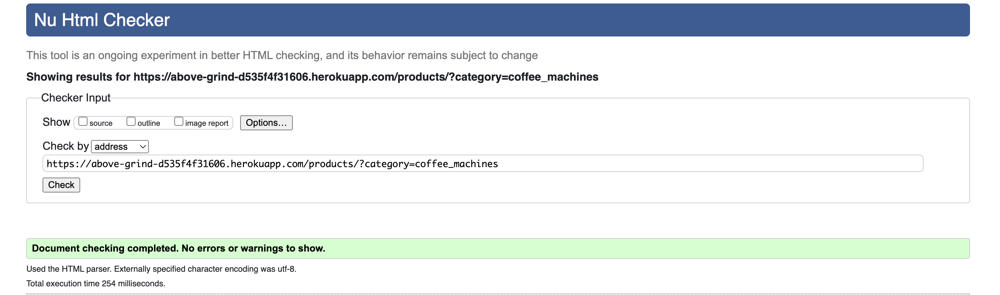
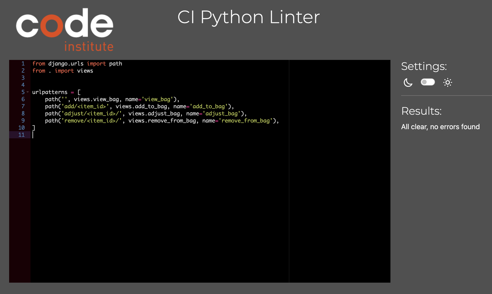
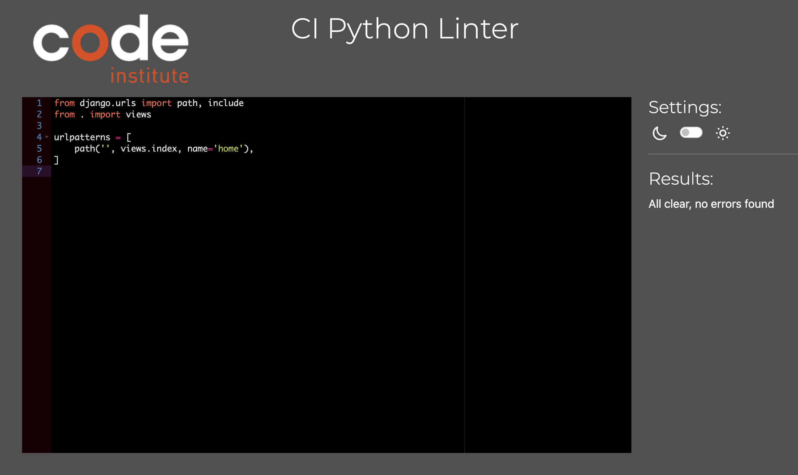
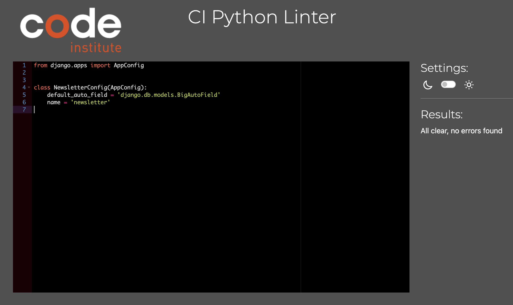

# Testing

Return back to the [README.md](README.md) file.

## Code Validation

### HTML

I have used the recommended [HTML W3C Validator](https://validator.w3.org) to validate all of my HTML files.

| Page | W3C URL | Screenshot | Notes |
| --- | --- | --- | --- |
| Home | [W3C](https://validator.w3.org/nu/?doc=https://above-grind-d535f4f31606.herokuapp.com/) |  | Pass: No Errors |
| Products | [W3C](https://validator.w3.org/nu/?doc=https://above-grind-d535f4f31606.herokuapp.com/products/) |  | Pass: No Errors |
| Product Detail |[W3C](https://validator.w3.org/nu/?doc=https://above-grind-d535f4f31606.herokuapp.com/products/?category=coffee_machines)|  | Pass: No Errors |
| Newsletter | [W3C](https://validator.w3.org/nu/?doc=https://above-grind-d535f4f31606.herokuapp.com/newsletter/) |  | Pass: No Errors |
| Faqs | [W3C](https://validator.w3.org/nu/?doc=https://above-grind-d535f4f31606.herokuapp.com/faqs/)|  | Pass: No Errors |
| Returns | [W3C](https://validator.w3.org/nu/?doc=https://above-grind-d535f4f31606.herokuapp.com/faqs/returns/)|  | Pass: No Errors |
| Contact | [W3C](https://validator.w3.org/nu/?doc=https://above-grind-d535f4f31606.herokuapp.com/contact/)|  | Pass: No Errors |
| Checkout |[W3C](https://validator.w3.org/nu/?doc=https%3A%2F%2Fabove-grind-d535f4f31606.herokuapp.com%2Fcheckout%2Fl)|  | Pass: No Errors |

### CSS

I have used the recommended [CSS Jigsaw Validator](https://jigsaw.w3.org/css-validator) to validate all of my CSS files.

| File | Jigsaw URL | Screenshot | Notes |
| --- | --- | --- | --- |
| base.css | [Jigsaw](https://jigsaw.w3.org/css-validator/validator?uri=https%3A%2F%2Fshellym96.github.io%2Fabove_grind) |  | Pass: No Errors |
| checkout.css | [Jigsaw](https://jigsaw.w3.org/css-validator/validator?uri=https%3A%2F%2Fshellym96.github.io%2Fabove_grind) |  | Pass: No Errors |
| contact.css | [Jigsaw](https://jigsaw.w3.org/css-validator/validator?uri=https%3A%2F%2Fshellym96.github.io%2Fabove_grind) |  | Pass: No Errors |
| newsletter.css | [Jigsaw](https://jigsaw.w3.org/css-validator/validator?uri=https%3A%2F%2Fshellym96.github.io%2Fabove_grind) |  | Pass: No Errors |
| profile.css | [Jigsaw](https://jigsaw.w3.org/css-validator/validator?uri=https%3A%2F%2Fshellym96.github.io%2Fabove_grind) |  | Pass: No Errors |

### JavaScript

I have used the recommended [JShint Validator](https://jshint.com) to validate all of my JS files.

| File | Screenshot | Notes |
| --- | --- | --- |
| category fixtures |  | Pass: No Errors |
| product fixtures |  | Pass: No Errors |
| stripe_elements.js |  | One undentified variable |
| countryfield.js |  | Pass: No Errors |

### Python

I have used the recommended [PEP8 CI Python Linter](https://pep8ci.herokuapp.com) to validate all of my Python files.

| File | CI URL | Screenshot | Notes |
| --- | --- | --- | --- |
|Above Grind- urls.py | [PEP8 CI](https://pep8ci.herokuapp.com/https://raw.githubusercontent.com/shellym96/above_grind/main/run.py) |  | Pass: No Errors |
|Above Grind- views.py | [PEP8 CI](https://pep8ci.herokuapp.com/https://raw.githubusercontent.com/shellym96/above_grind/main/above_grind/views) |  | Pass: No Errors |
| Above Grind- wsgi views.py | [PEP8 CI](https://pep8ci.herokuapp.com/https://raw.githubusercontent.com/shellym96/above_grind/main/blog/views.py) |  | Pass: No Errors |
| Bag- apps urls.py | [PEP8 CI](https://pep8ci.herokuapp.com/https://raw.githubusercontent.com/shellym96/above_grind/main/bag/urls.py) |  | Pass: No Errors |
| Bag- context.py | [PEP8 CI](https://pep8ci.herokuapp.com/https://raw.githubusercontent.com/shellym96/above_grind/main/bag/models.py) |  | Pass: No Errors |
| Bag- urls.py | [PEP8 CI](https://pep8ci.herokuapp.com/https://raw.githubusercontent.com/shellym96/above_grind/main/bag/models.py) |  | Pass: No Errors |
| Bag- views.py | [PEP8 CI](https://pep8ci.herokuapp.com/https://raw.githubusercontent.com/shellym96/above_grind/main/bag/models.py) |  | Pass: No Errors |
| Checkout- admin.py | [PEP8 CI](https://pep8ci.herokuapp.com/https://raw.githubusercontent.com/shellym96/above_grind/main/checkout/models.py) |  | Pass: No Errors |
| Checkout- admin.py | [PEP8 CI](https://pep8ci.herokuapp.com/https://raw.githubusercontent.com/shellym96/above_grind/main/checkout/admin.py) |  | Pass: No Errors |
| Checkout- app.py | [PEP8 CI](https://pep8ci.herokuapp.com/https://raw.githubusercontent.com/shellym96/above_grind/main/checkout/apps.py) |  | Pass: No Errors |
| Checkout- forms.py | [PEP8 CI](https://pep8ci.herokuapp.com/https://raw.githubusercontent.com/shellym96/above_grind/main/checkout/forms.py) |  | Pass: No Errors |
| Checkout- models.py | [PEP8 CI](https://pep8ci.herokuapp.com/https://raw.githubusercontent.com/shellym96/above_grind/main/checkout/models.py) |  | Pass: No Errors |
| Checkout- urls.py | [PEP8 CI](https://pep8ci.herokuapp.com/https://raw.githubusercontent.com/shellym96/above_grind/main/checkout/urls.py) |  | Pass: No Errors |
| Checkout- signal.py | [PEP8 CI](https://pep8ci.herokuapp.com/https://raw.githubusercontent.com/shellym96/above_grind/main/checkout/signal.py) |  | Pass: No Errors |
| Checkout- views.py | [PEP8 CI](https://pep8ci.herokuapp.com/https://raw.githubusercontent.com/shellym96/above_grind/main/checkout/views.py) |  | Pass: No Errors |
| Checkout- wb-handler.py | [PEP8 CI](https://pep8ci.herokuapp.com/https://raw.githubusercontent.com/shellym96/above_grind/main/checkout/wb-handler.py) |  | Pass: No Errors |
| Checkout- webhooks.py | [PEP8 CI](https://pep8ci.herokuapp.com/https://raw.githubusercontent.com/shellym96/above_grind/main/checkout/webhooks.py) |  | Pass: No Errors |
| Contact- admin.py | [PEP8 CI](https://pep8ci.herokuapp.com/https://raw.githubusercontent.com/shellym96/above_grind/main/contact/admin.py) |  | Pass: No Errors |
| Contact- apps.py | [PEP8 CI](https://pep8ci.herokuapp.com/https://raw.githubusercontent.com/shellym96/above_grind/main/contact/apps.py) |  | Pass: No Errors |
| Contact- forms.py | [PEP8 CI](https://pep8ci.herokuapp.com/https://raw.githubusercontent.com/shellym96/above_grind/main/contact/forms.py) |  | Pass: No Errors |
| Contact- models.py | [PEP8 CI](https://pep8ci.herokuapp.com/https://raw.githubusercontent.com/shellym96/above_grind/main/contact/models.py) |  | Pass: No Errors |
| Contact- urls.py | [PEP8 CI](https://pep8ci.herokuapp.com/https://raw.githubusercontent.com/shellym96/above_grind/main/contact/urls.py) |  | Pass: No Errors |
| Contact- views.py | [PEP8 CI](https://pep8ci.herokuapp.com/https://raw.githubusercontent.com/shellym96/above_grind/main/contact/views.py) |  | Pass: No Errors |
| Custom storages | [PEP8 CI](https://pep8ci.herokuapp.com/https://raw.githubusercontent.com/shellym96/above_grind/main/contact/customstorages.py) |  | Pass: No Errors |
| Faqs- admin.py | [PEP8 CI](https://pep8ci.herokuapp.com/https://raw.githubusercontent.com/shellym96/above_grind/main/faqs/admin.py) |  | Pass: No Errors |
| Faqs- app.py | [PEP8 CI](https://pep8ci.herokuapp.com/https://raw.githubusercontent.com/shellym96/above_grind/main/faqs/models.py) |  | Pass: No Errors |
| Faqs- form.py | [PEP8 CI](https://pep8ci.herokuapp.com/https://raw.githubusercontent.com/shellym96/above_grind/main/faqs/forms.py) |  | Pass: No Errors |
| Faqs- models.py | [PEP8 CI](https://pep8ci.herokuapp.com/https://raw.githubusercontent.com/shellym96/above_grind/main/faqs/models.py) |  | Pass: No Errors |
| Faqs- urls.py | [PEP8 CI](https://pep8ci.herokuapp.com/https://raw.githubusercontent.com/shellym96/above_grind/main/faqs/urls.py) |  | Pass: No Errors |
| Faqs- views.py | [PEP8 CI](https://pep8ci.herokuapp.com/https://raw.githubusercontent.com/shellym96/above_grind/main/faqs/views.py) |  | Pass: No Errors |
| Home- app.py | [PEP8 CI](https://pep8ci.herokuapp.com/https://raw.githubusercontent.com/shellym96/above_grind/main/home/apps.py) |  | Pass: No Errors |
| Home- urls.py | [PEP8 CI](https://pep8ci.herokuapp.com/https://raw.githubusercontent.com/shellym96/above_grind/main/home/urls.py) |  | Pass: No Errors |
| Newsletter- admin.py | [PEP8 CI](https://pep8ci.herokuapp.com/https://raw.githubusercontent.com/shellym96/above_grind/main/newsletter/admin.py) |  | Pass: No Errors |
| Newsletter- apps.py | [PEP8 CI](https://pep8ci.herokuapp.com/https://raw.githubusercontent.com/shellym96/above_grind/main/newsletter/apps.py) |  | Pass: No Errors |
| Newsletter- forms.py | [PEP8 CI](https://pep8ci.herokuapp.com/https://raw.githubusercontent.com/shellym96/above_grind/main/newsletter/forms.py) |  | Pass: No Errors |
| Newsletter- models.py | [PEP8 CI](https://pep8ci.herokuapp.com/https://raw.githubusercontent.com/shellym96/above_grind/main/newsletter/models.py) |  | Pass: No Errors |
| Newsletter- urls.py | [PEP8 CI](https://pep8ci.herokuapp.com/https://raw.githubusercontent.com/shellym96/above_grind/main/newsletter/urls.py) |  | Pass: No Errors |
| Newsletter- views.py | [PEP8 CI](https://pep8ci.herokuapp.com/https://raw.githubusercontent.com/shellym96/above_grind/main/newsletter/views.py) |  | Pass: No Errors |
| Above Grind- urls.py | [PEP8 CI](https://pep8ci.herokuapp.com/https://raw.githubusercontent.com/shellym96/above_grind/main/abovegrind/urls.py) |  | Pass: No Errors |
| Above Grind- views.py | [PEP8 CI](https://pep8ci.herokuapp.com/https://raw.githubusercontent.com/shellym96/above_grind/main/abovegrind/views.py) |  | Pass: No Errors |
| Profile- app.py | [PEP8 CI](https://pep8ci.herokuapp.com/https://raw.githubusercontent.com/shellym96/above_grind/main/profiles/app.py) |  | Pass: No Errors |
| Profile- forms.py | [PEP8 CI](https://pep8ci.herokuapp.com/https://raw.githubusercontent.com/shellym96/above_grind/main/profiles/forms.py) |  | Pass: No Errors |
| Profile- models.py | [PEP8 CI](https://pep8ci.herokuapp.com/https://raw.githubusercontent.com/shellym96/above_grind/main/profiles/models.py) |  | Pass: No Errors |
| Profile- views.py | [PEP8 CI](https://pep8ci.herokuapp.com/https://raw.githubusercontent.com/shellym96/above_grind/main/profiles/views.py) |  | Pass: No Errors |

## Browser Compatibility
I've tested my deployed project on multiple browsers to check for compatibility issues.

| Browser | Home | Products | Newsletter/Returns | FAQ/Contact | Checkout | Notes | |
| --- | --- | --- | --- | --- | --- | --- | --- |
| Chrome |  |  |  |  |   | Works as expected |
| Firefox |  |  |  |   |  | Works as expected |
| Opera |  |  |  |  |  |Works as expected |
| Safari |  |  |  | |  | Works as expected |

## Responsiveness
I've tested my deployed project on multiple devices to check for responsiveness issues.

| Device | Home | Products | Contact | Notes | |
| --- | --- | --- | --- | --- | --- |
| Mobile (DevTools) |  |  |  | Works as expected 
| Tablet (DevTools) |  |  |  | Works as expected 
| Desktop |  |  |   |Works as expected
## Lighthouse Audit

I've tested my deployed project using the Lighthouse Audit tool to check for any major issues.

| Page | Mobile | Desktop | Notes |
| --- | --- | --- | --- |
| Home |  |  | Some minor warnings |
| Products |  |  | Some minor warnings |
| FAQs |  |  | Some minor warnings |
| Newsletter |  |  | Some minor warnings |
| Checkout |  |  | Some minor warnings |
| Returns |  |  | Some minor warnings|
| Profile |  |  | Some minor warnings |

## Defensive Programming

Defensive programming was manually tested with the below user acceptance testing:

| Page | Expectation | Test | Result | Fix | Screenshot |
| --- | --- | --- | --- | --- | --- |
| Home | | | | | |
| | The home is to show the user what the site sells| Entering the site | It is clear the site sells coffee  | Test concluded and passed |  |
| Products | | | | | |
| | Products page is to show what we sell | Tested by going onto the product page | The feature broadcasts all the products sold. | Test concluded and passed|  |
| Product Detail | | | | | |
| | Bring the user to the description of the product | Tested by clicking the product image | The feature behaved as expected, and it showed the product details| Test concluded and passed |  |
| Bag | | | | | |
| | Bring the user to secure their shopping bag | When clicking into the bag it shows the products inside | The feature did exactly that. | Test concluded and passed |  |
| Checkout | | | | | |
| | The checkout is to show the user where to fill out their delivery information and accept payments | Tested the feature by making a payment | The feature behaved as expected | Test concluded and passed |  |
| Faqs | | | | | |
| | Faqs is to show the user the delivery and returns information | Tested the feature by clicking the faqs link | The feature did exactly as it should | Test concluded and passed |  |
| Contact | | | | | |
| | Contact us is supposed to give the user a form to fill out and send to the company | Tested the feature by filling in the form and sending it in | The feature behaved by giving me a success message and going through to admin panel | Test concluded and passed |  |

| Page | User Action | Expected Result | Pass/Fail | Comments |
| --- | --- | --- | --- | --- |
| Home | | | | |
| | Click on Logo | Redirection to Home page | Pass | |
| | Click on black button on image | Redirection to products page | Pass | |
| Products | | | | |
| | Click on product image | Redirection to product description  page | Pass | |
| | Can click add product to bag | User gets a pop up message to say item has been added to bag successfully | Pass | |
| Product Detail | | | | |
| | Description of product | Reabable description of the product to see if you'd like to buy it | Pass | |
| | Adding item to bag | Can click +/- to add more than one item to your bag | Pass | |
| Bag | | | | |
| | Update or edit | You can update the items via the edit/update/delete buttons | Pass | |
| Checkout | | | | |
| | Checkout page | You can enter your details for delivery and payments | Pass | |
| | Save information | You can click the save information button, to save re-entering details later | Pass | |
| Contact | | | | |
| | Click on Contact link in footer | Redirection to Contact page | Must be logged in | |
| | Fill out the form | Each subject field | Pass | |
| | Enter valid email address | Field will only accept email address format | Pass | |
| | Enter message in textarea | Field will accept freeform text | Pass | |
| | Click the Submit button | Gives user a success messages | Pass | User must click 'Back' button to return |
| Newsletter | | | | |
| | Sign up to newsletter | Enter your name and email address | Pass | |
| | Sign up button | Click the button and you will receive a success message to say Thank you for signing up! | Pass | |
| Faqs | | | | |
| | Faqs | Dropdown with the delivery information | Pass | |
| | Faqs | Dropdown with the returns information | Pass | |
| | Faqs | Dropdown with information on how to get in touch | Pass | |
| | Faqs | Dropdowns with how to create a profile | Pass | |
| Sign Up To | | | | |
| | Click on Sign Up button | Redirection to Sign Up page | Pass | |
| | Enter valid email address | Field will only accept email address format | Pass | |
| | Enter valid password (twice) | Field will only accept password format | Pass | |
| | Click on Sign Up button | Asks user to confirm email page | Pass | Email sent to user |
| | Confirm email | Redirects user to blank Sign In page | Pass | |
| Log In | | | | |
| | Click on the Login link | Redirection to Login page | Pass | |
| | Enter valid email address | Field will only accept email address format | Pass | |
| | Enter valid password | Field will only accept password format | Pass | |
| | Click Login button | Redirects user to home page | Pass | |
| Log Out | | | | |
| | Click Logout button | Redirects user to logout page | Pass | Confirms logout first |
| | Click Confirm Logout button | Redirects user to home page | Pass | |
| Profile | | | | |
| | Click on Profile button | User will be redirected to the Profile page | Pass | |
| | Click on the My Orders link | User will be redirected to the My Orders page | Pass | |

## User Story Testing

| User Story | Screenshot |
| --- | --- |
| As a new site user, I would like to see what the site sells, so that I can know I am in the right place to purchase what I'm looking for. |  |
| As a new site user, I would like to be able to click a sort button so that I can find my product my price/rating.|  |
| As a new site user, I would like to have the option to add the number of products to my bag, so that I can click one button instead of adding it more than once.|  |
| As a new site user, I would like to have the option to save my info so that I don't have to retype it if I should return. |  |
| As a new site user, I would like to have the option to sign up to a newsletter or subscribe so I can recieve updates on new products or discounts. |  |
| As a new site user , I would like to be able to fill out a contact us form incase I need to contact the owners. |  |

## Bugs

- A bug I had was on the order summary page, in regards to the order total, delivery and grand total price.  

    - To fix this, I had to fix the indentation in the apps file inside the checkout folder.

- A bug I had was on the faqs page. Not as much of a bug , but I had hard coded the faqs into the file as well as having my models. 

    - I fixed this by removing the text from the faqs.html and using the model to its advantage on the admin side.

- A bug I had is with the webhook handlers. I have the code in the project although there is an issue on the webhook handler side.

    - I left the code in the project for now, and will fix this at a later stage as the emails are sending to your email for sign up and into the terminal.

- A bug I had is with the footer, while making the footer a size to fit all information needed inside, it has popped up slightly when you access the site on a tablet. This was effecting the view of the homepage image, pushing it up slightly.

    - I have fixed this by adding margin-top: 4em , so the image fits without distorting text or view.

### GitHub **Issues**

**Fixed Bugs**

All previously closed/fixed bugs can be tracked [here](https://github.com/shellym96/above_grind/issues?q=is%3Aissue+is%3Aclosed).

**Open Issues**

Any remaining open issues can be tracked [here](https://github.com/shellym96/above_grind/issues).

## Unfixed Bugs

- A bug I had is with the webhook handlers. I have the code in the project although there is an issue on the webhook handler side.

    - I left the code in the project for now, and will fix this at a later stage as the emails are sending to your email for sign up and into the terminal.

- A bug I have last minute before submission was my footer popping up slightly when you bring it to tablet mode.

    - This happened by fixing a previous issue I had with the footer hiding some of the main text on the front image of the site. 

There are no remaining bugs that I am aware of.
